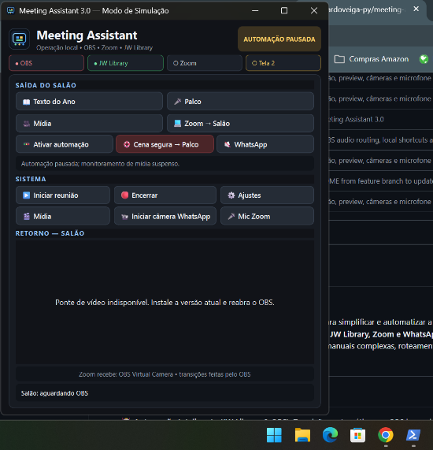
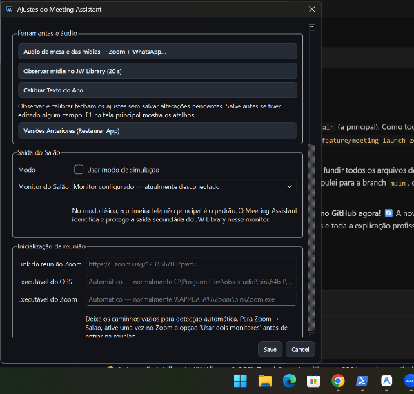
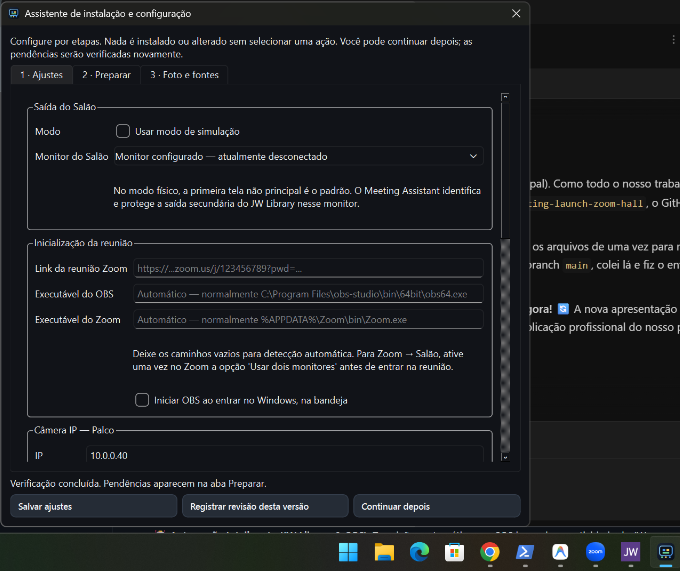

# 🖥️ Meeting Assistant


O **Meeting Assistant** é um orquestrador open-source criado para simplificar e automatizar a operação de áudio e vídeo em Salões do Reino. Ele conecta e coordena **OBS Studio, JW Library, Zoom e WhatsApp**, permitindo que o operador foque na reunião, sem se preocupar com transições manuais complexas, roteamento de áudio ou gerenciamento de múltiplas janelas.

---


## 📸 Telas do Aplicativo

<p align="center">
  
  
  
</p>

---

## ✨ Principais Funcionalidades

* **🤖 Automação Inteligente (JW Library & OBS):** 
  Transições automáticas no OBS baseadas na atividade do JW Library. O sistema lê o áudio direto do kernel do Windows (`pycaw`) garantindo precisão absoluta. Ao dar "Play" no JWL, o app corta o áudio da mesa no OBS automaticamente, prevenindo microfonias e vazamentos.
* **🎥 Câmera Virtual Integrada (WhatsApp & Zoom):**
  Uma ponte de vídeo nativa (Media Foundation) capta a saída do OBS Studio e cria uma câmera virtual ultraleve, otimizada para o WhatsApp UWP e Zoom (sem depender de plugins como NDI).
* **🎬 Projeção de Mídia Externa (VLC, MPC, Fotos):**
  Precisa reproduzir um arquivo de fora do JW Library? Um clique no botão **Mídia** encontra o VLC ou reprodutor ativo, remove suas bordas, e o projeta em tela cheia na Tela 2. Ao desativar, devolve o controle automaticamente para o JW Library.
* **🎤 Controle Silencioso do Zoom:**
  Gerencie o microfone do Zoom diretamente pelo painel do Meeting Assistant. O sistema usa automação invisível (`pywinauto` UIA) para mutar/desmutar o Zoom em segundo plano, sem roubar o foco ou atrapalhar o operador.
* **🔄 Atualizações Automáticas (Auto-updater):**
  Sempre que houver melhorias, o aplicativo avisará com um banner visual. Com um clique, ele baixa a nova versão do GitHub e atualiza silenciosamente.
* **🕰️ Máquina do Tempo (Rollback):**
  Deu algum problema no dia da reunião? A aba de Ajustes permite restaurar o aplicativo para qualquer uma das últimas 5 versões lançadas com um único clique.
* **🎮 Modo de Simulação:**
  Treine novos operadores em casa ou em notebooks comuns sem bagunçar as configurações oficiais ou precisar de dois monitores físicos.

---

## 🛠️ Arquitetura de Áudio e Vídeo

O fluxo de mídia automatizado reduz a carga cognitiva do operador. A rota padrão é:

```text
JW Library / VLC / Câmeras do Salão
               |
      Captura de Áudio/Vídeo no OBS
               |
        Mixer / Transições (OBS)
               |
    [Câmera Virtual OBS] + [VB-CABLE Output]
               |
        Zoom + WhatsApp
```
*(Nota: O uso do VB-CABLE é recomendado para separar o áudio das mídias enviadas remotamente).*

---

## 🚀 Instalação (Windows 11)

**O instalador já inclui o Python embutido e todas as bibliotecas necessárias.**

1. Acesse a área de [Releases](../../releases) deste repositório.
2. Baixe o instalador da última versão (Ex: `MeetingAssistant-Setup-X.Y.Z.exe`).
3. Execute e siga as etapas da tela.
4. Abra o **Meeting Assistant** pelo menu Iniciar.
5. Na primeira abertura, configure as opções do OBS e selecione a Tela do Salão (Tela 2) na aba de Ajustes (⚙️).

### Pré-requisitos Externos:
* **Windows 11 x64** (Obrigatório para a câmera virtual Media Foundation)
* **OBS Studio** (com configuração de WebSocket ativada)
* **Zoom Desktop** e/se **WhatsApp (UWP)**
* **JW Library para Windows**
* **VB-CABLE** (Driver de áudio virtual, recomendado)

---

## 💻 Painel do Sistema (Operação)

O painel principal foi desenhado para uso em monitores de toque ou mouse, de forma extremamente enxuta:

| Botão | Ação |
|---|---|
| **▶ Iniciar Reunião** | Inicia OBS, Zoom, JWL, câmera virtual e conecta o WebSocket automaticamente. |
| **🔴 Encerrar** | Fecha os aplicativos da reunião e devolve o PC ao estado normal de uso. |
| **⚙️ Ajustes** | Configurações de Telas, Cenas do OBS, Atualizações, Diagnósticos e Rollback. |
| **🎬 Mídia** | Intercepta reprodutores externos (VLC/Fotos) e os força para a Tela 2 em tela cheia. |
| **📷 Câmera WhatsApp** | Inicia/Para o envio de vídeo do OBS para o aplicativo do WhatsApp. |
| **🎤 Mic Zoom** | Alterna entre "Mudo/Aberto" no Zoom em segundo plano. |

Também possui suporte total a atalhos de teclado de **F1** a **F10** para operadores ágeis.

---

## 👨‍💻 Para Desenvolvedores

Se deseja modificar ou rodar a partir do código fonte:

```powershell
git pull --ff-only
.\scripts\run.ps1
```

O script `.ps1` criará o ambiente virtual (`.venv`), instalará dependências via `pip` e cuidará dos binários e DLLs nativas em C++ responsáveis pela Virtual Camera.

**Dependências Principais:**
- `PySide6` (GUI)
- `pywinauto` e `pycaw` (Automação de Janelas e Áudio do Windows)
- `obsws-python` (Integração com OBS via WebSocket)

---

## ⚠️ Avisos e Isenção de Responsabilidade
O **Meeting Assistant** é um projeto independente e não-oficial. Não possui qualquer afiliação direta com JW Library, Zoom Video Communications ou OBS Project. Marcas e softwares pertencem aos seus respectivos criadores.

*Nota de Privacidade:* Logs gerados pela telemetria interna de diagnóstico são armazenados no `%APPDATA%` e desvinculados da operação real.
