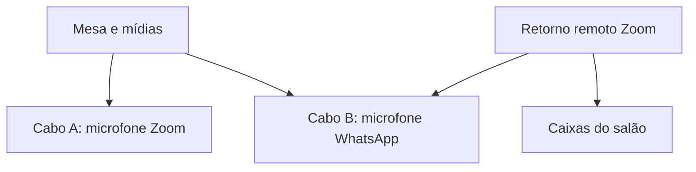

# Áudio da mesa e das mídias

A câmera virtual transmite vídeo. O áudio entra no Zoom e no WhatsApp pelos
microfones virtuais configurados manualmente nos dois aplicativos. O retorno do
WhatsApp começa silenciado pelo app; seu botão controla apenas os alto-falantes
recebidos do WhatsApp, preservando Zoom, mídias e o volume geral.

## Perfil comum — um cabo

| Fonte | Monitoramento OBS para CABLE-A Input | Microfone Zoom | Microfone WhatsApp |
| --- | --- | --- | --- |
| Entrada física da mesa | Sim | CABLE-A Output | CABLE-A Output |
| JW Library / VLC / navegador selecionado | Sim | CABLE-A Output | CABLE-A Output |
| Retorno remoto do Zoom | Não | Excluído | Excluído |
| Retorno remoto do WhatsApp | Não | Excluído | Excluído |

Em Ajustes → Áudio, escolha **Mesa + mídias nos dois aplicativos**. Selecione
explicitamente a entrada física da mesa e somente os aplicativos usados.
Configure **CABLE-A Input** como dispositivo de monitoramento do OBS;
**CABLE-A Output** como microfone dos dois aplicativos. A saída física continua
alimentando a mesa/caixas do salão. O app bloqueia Zoom como fonte neste perfil.

O app confere o dispositivo no perfil local salvo do OBS. O WebSocket não fornece
uma consulta da saída global de monitoramento em execução; a confirmação do
operador e o teste remoto continuam obrigatórios. Perfis portáteis não encontrados
precisam ser configurados pelo OBS antes de ativar essa rota.

O OBS usa **Monitorar apenas (silenciar saída)** nas fontes locais do app;
nenhuma das seis faixas Program recebe essas fontes. Assim outro monitoramento
não deve duplicar a mistura. Outras fontes pessoais não são reconfiguradas:
se estiverem sendo monitoradas, a ativação pede revisão e permanece silenciada.

## Perfil opcional — WhatsApp recebe também os participantes do Zoom

um cabo único não pode entregar dois mixes diferentes. Instale/configure uma
**segunda entrada virtual (CABLE-B Input)**, com endpoint de gravação correspondente, e o plugin
[Audio Monitor 0.10.1 do Exeldro](https://github.com/exeldro/obs-audio-monitor/releases/tag/0.10.1)
no OBS. A implementação usa os filtros do plugin; não modifica o driver de áudio
nem os componentes nativos da câmera. O plugin é distribuído por seu autor sob GPL-2.0;
a instalação é separada, pela distribuição oficial.

1. Instale os Cabos A e B e Audio Monitor e reinicie OBS/Windows conforme os instaladores.
2. Em Ajustes → Áudio, prepare as listas e escolha **WhatsApp também recebe participantes do Zoom**.
3. Selecione a segunda entrada virtual (CABLE-B Input) para WhatsApp. Ela deve ser diferente de
   **CABLE-A Input**, usado no monitoramento global do OBS.
4. Selecione mesa, mídias e a janela/processo de áudio do Zoom. No Zoom, mantenha
   o primeiro **CABLE-A Output** como microfone e a saída física como alto-falante.
5. No WhatsApp, selecione o endpoint de gravação correspondente ao Cabo B
   como microfone; a saída física permanece silenciada pelo app até ser liberada.
6. Confirme o roteamento e ative. O retorno Zoom fica **sem monitoramento global**
   e sem faixas Program; apenas o filtro dedicado o envia ao Cabo B.

Plugin ausente, destino desconectado, cabos iguais ou filtro não confirmado
bloqueiam a ativação. Fontes gerenciadas são silenciadas em falhas parciais.
Nenhum retorno WhatsApp é capturado. Não selecione um cabo virtual como entrada da mesa.

## Ganho e distorção

Cada fonte tem ganho ajustável de **0 a 18 dB**, seguido de limitador em **−3 dB**.
Comece em 0 dB, teste fala e uma mídia conhecida e aumente em pequenos passos.
O app lê os medidores do OBS; os níveis medidos não comprovam o volume recebido
no aparelho remoto. O limitador contém picos, mas não recupera áudio já distorcido
na entrada USB/mesa. Os filtros precisam ser confirmados pelo OBS para ativar.
Os antigos filtros de ganho/limitador do app são desativados ao migrar, evitando
somar o ganho antigo ao novo. As escolhas de perfil/ganho são salvas nos ajustes;
a ativação das fontes fica na coleção de cenas do OBS.

## Limite físico a verificar

A entrada USB da mesa deve conter apenas os microfones locais. Se ela também
recebe o áudio das mídias ou dos participantes Zoom, capturar esse mesmo áudio
por aplicativo cria duplicação ou retorno ao próprio Zoom. Software não separa
com confiabilidade canais já somados em um sinal analógico. Nesse caso, primeiro
revise a ligação física ou separe os retornos antes de chegarem à mesa.

Teste fora da reunião: fala, mídia, comentário Zoom ouvido no WhatsApp,
WhatsApp silenciado no salão e ausência de eco em ambos os sentidos. A rota
separada deste lote ainda exige validação física; o sucesso anterior com um
cabo não valida automaticamente este segundo perfil.
