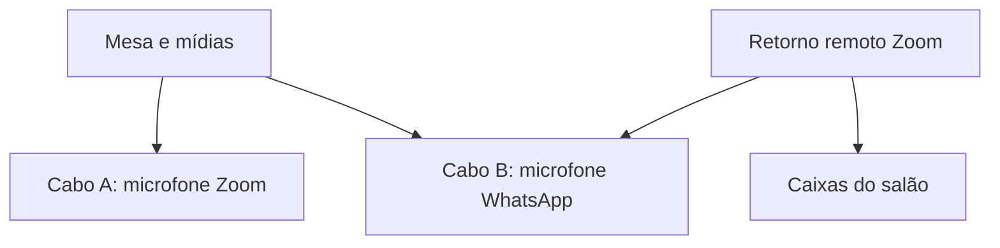

# Áudio da mesa e das mídias

A câmera virtual transmite vídeo. O áudio entra no Zoom e no WhatsApp pelos
microfones virtuais configurados manualmente nos dois aplicativos. O retorno do
WhatsApp começa silenciado pelo app; seu botão controla apenas os alto-falantes
recebidos do WhatsApp, preservando Zoom, mídias e o volume geral.

## Perfil comum — um cabo

| Fonte | Monitoramento OBS para CABLE-A Input | Microfone Zoom | Microfone WhatsApp |
| --- | --- | --- | --- |
| Entrada física da mesa | Sim | CABLE-A Output | CABLE-A Output |
| JW Library / VLC / navegador selecionado | Sim | CABLE-A Output | CABLE-A Output |
| Retorno remoto do Zoom | Não | Excluído | Excluído |
| Retorno remoto do WhatsApp | Não | Excluído | Excluído |

Em Ajustes → Áudio → Envio, escolha **Mesa e mídias nos dois aplicativos**. Selecione
explicitamente a entrada física da mesa e somente os aplicativos usados.
Configure **CABLE-A Input** como dispositivo de monitoramento do OBS;
**CABLE-A Output** como microfone dos dois aplicativos. A saída física continua
alimentando a mesa/caixas do salão. O app bloqueia Zoom como fonte neste perfil.

O app confere o dispositivo no perfil local salvo do OBS. O WebSocket não fornece
uma consulta da saída global de monitoramento em execução; a confirmação do
operador e o teste remoto continuam obrigatórios. Perfis portáteis não encontrados
precisam ser configurados pelo OBS antes de ativar essa rota.

O OBS usa **Monitorar apenas (silenciar saída)** nas fontes locais do app;
nenhuma das seis faixas Program recebe essas fontes. Assim outro monitoramento
não deve duplicar a mistura. Outras fontes pessoais não são reconfiguradas:
se estiverem sendo monitoradas, a ativação pede revisão e permanece silenciada.

## Perfil opcional — WhatsApp recebe também os participantes do Zoom

um cabo único não pode entregar dois mixes diferentes. Instale/configure uma
**segunda entrada virtual (CABLE-B Input)**, com endpoint de gravação correspondente, e o plugin
[Audio Monitor 0.10.1 do Exeldro](https://github.com/exeldro/obs-audio-monitor/releases/tag/0.10.1)
no OBS. A implementação usa os filtros do plugin; não modifica o driver de áudio
nem os componentes nativos da câmera. O plugin é distribuído por seu autor sob GPL-2.0;
a instalação usa a distribuição oficial. **Ajustes → Instalação e plugins →
Instalar Audio Monitor** verifica o pacote antes de instalar, com OBS fechado.

1. Instale os Cabos A e B e Audio Monitor e reinicie OBS/Windows conforme os instaladores.
2. Em Ajustes → Áudio → Envio, atualize a lista e escolha **Incluir participantes do Zoom no WhatsApp**.
3. Selecione a segunda entrada virtual (CABLE-B Input) para WhatsApp. Ela deve ser diferente de
   **CABLE-A Input**, usado no monitoramento global do OBS.
4. Selecione mesa, mídias e a janela/processo de áudio do Zoom. No Zoom, mantenha
   o primeiro **CABLE-A Output** como microfone e a saída física como alto-falante.
5. No WhatsApp, selecione o endpoint de gravação correspondente ao Cabo B
   como microfone; a saída física permanece silenciada pelo app até ser liberada.
6. Confirme o roteamento e ative. O retorno Zoom fica **sem monitoramento global**
   e sem faixas Program; apenas o filtro dedicado o envia ao Cabo B.

Plugin ausente, destino desconectado, cabos iguais ou filtro não confirmado
bloqueiam a ativação. Fontes gerenciadas são silenciadas em falhas parciais.
Nenhum retorno WhatsApp é capturado. Não selecione um cabo virtual como entrada da mesa.

## Ganho e distorção

### Envio, Volumes e Ajuda

Abrir a tela ou clicar em **Atualizar lista** consulta a configuração existente do
OBS sem criar fontes, silenciar ou alterar o envio. A aba **Envio** mostra mesa,
JWL e, no perfil com retorno, Zoom e o segundo cabo. VLC e navegadores ficam em
**Outras mídias**. As instruções de instalação e conferência ficam em **Ajuda**.

**Completar fontes de áudio** aparece quando faltam fontes, vínculos ou a cena de
áudio. Cria somente o que falta: fontes novas começam silenciadas e desativadas;
fontes existentes, filtros e envio permanecem como estavam. **Ativar envio**
aplica a seleção de dispositivos e o roteamento explicitamente.
Escolhas e ganhos editados permanecem quando disponíveis. Dispositivos ausentes
voltam a **Não selecionado**, sem selecionar outra entrada automaticamente.

No perfil com Zoom, escolha uma segunda entrada virtual, diferente do monitoramento
OBS. Cabos ativos são enumerados pelo valor do estado Core Audio, incluindo o
`AudioDeviceState` do pycaw 20240210. O cabo usado pelo monitoramento é removido
das opções do segundo destino. Instalar Audio Monitor não instala esse segundo cabo.
Se ele não for encontrado, a tela orienta instalar e depois atualizar a lista.

Confira os dispositivos das chamadas e o caminho físico da mesa e marque a confirmação
de roteamento. **Ativar envio** fica clicável: se faltar algo, mostra a pendência e
foca o campo, sem enviar uma seleção inválida. Alterar uma seleção exige reconfirmar;
atualização somente de leitura com as mesmas escolhas preserva a confirmação.

Para aumentar apenas uma fonte já configurada: **Volumes** no painel principal,
ajuste o ganho e clique **Aplicar volumes**. A categoria Áudio abre diretamente
na aba Volumes, dentro da mesma janela Ajustes.
Essa ação usa a fila WebSocket existente e escreve somente nos filtros de ganho
alterados. Preserva mute, monitoramento, faixas, cenas, dispositivos e envio separado
ao WhatsApp; não exige reconfirmar o roteamento nem selecionar o segundo cabo novamente.
Os filtros de ganho e limitador devem estar configurados e habilitados. Fontes sem
esses filtros precisam da configuração inicial na aba Envio e não aparecem como prontas.

Os ganhos existentes são lidos do OBS. A mudança é confirmada por leitura do filtro
e salva no app; diante de falha, tenta restaurar os ganhos anteriores sem silenciar
o mix. Restauração incompleta é informada. O campo não atua em tempo real: é preciso
clicar em **Aplicar volumes**. **0 dB** mantém o nível original. Ouvir no dispositivo
remoto continua obrigatório.

### Níveis

Cada fonte tem ganho ajustável de **−30 a +18 dB**, seguido de limitador em **−3 dB**.
Comece em 0 dB, teste fala e uma mídia conhecida e aumente em pequenos passos.
O app lê os medidores do OBS; os níveis medidos não comprovam o volume recebido
no aparelho remoto. O limitador contém picos, mas não recupera áudio já distorcido
na entrada USB/mesa. Os filtros precisam ser confirmados pelo OBS para ativar.
Os antigos filtros de ganho/limitador do app são desativados ao migrar, evitando
somar o ganho antigo ao novo. As escolhas de perfil/ganho são salvas nos ajustes;
a ativação das fontes fica na coleção de cenas do OBS.

Filtros opcionais e atraso ficam em **Envio → Filtros e sincronização**,
recolhidos por padrão. Ganho e atraso editados são confirmados por leitura;
o intervalo de atraso é −950 a 20.000 ms. Aplicar apenas um ganho não altera
atraso, filtros opcionais ou roteamento. [Organização e manutenção](settings-workspace.md).

## Limite físico a verificar

A entrada USB da mesa deve conter apenas os microfones locais. Se ela também
recebe o áudio das mídias ou dos participantes Zoom, capturar esse mesmo áudio
por aplicativo cria duplicação ou retorno ao próprio Zoom. Software não separa
com confiabilidade canais já somados em um sinal analógico. Nesse caso, primeiro
revise a ligação física ou separe os retornos antes de chegarem à mesa.

Teste fora da reunião: fala, mídia, comentário Zoom ouvido no WhatsApp,
WhatsApp silenciado no salão e ausência de eco em ambos os sentidos. A rota
separada deste lote ainda exige validação física; o sucesso anterior com um
cabo não valida automaticamente este segundo perfil.
