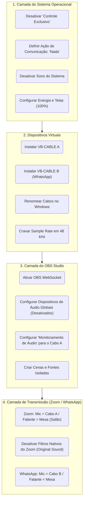
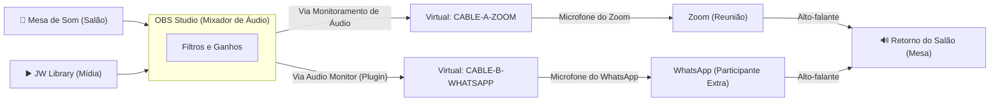

# Manual de Preparação da Máquina (Salão do Reino)

Este documento descreve a configuração base manual que deve ser feita no computador antes que o *Meeting Assistant* (ou qualquer automação) comece a operar. Uma fundação sólida no sistema operacional é o que previne microfonias, áudio robótico e travamentos.

## 1. Organograma do Processo de Configuração

---

## 2. Diagrama de Roteamento de Áudio (Arquitetura Mix-Minus)

O objetivo desta arquitetura é garantir que a voz do Salão e os vídeos do JW Library vão para a chamada, **mas o retorno da chamada não volte para ela mesma** (causando eco infinito).

---

## 3. Passo a Passo de Execução Manual

### FASE 1: O Sistema Operacional (Windows 11)
1. **Atividade de Comunicação:**
   - Vá em `Painel de Controle` -> `Som` -> aba `Comunicações`.
   - Marque a opção: **"Não fazer nada"** (Isso impede que o Windows abaixe o volume das mídias quando alguém falar no Zoom).
2. **Modo Exclusivo (Microfones e Caixas):**
   - No `Painel de Controle` -> `Som`, clique duas vezes no seu microfone da Mesa, vá na aba `Avançado`.
   - **Desmarque** a opção: "Permitir que os aplicativos assumam o controle exclusivo deste dispositivo".
   - Repita o processo para os Alto-falantes.
3. **Sons do Sistema:**
   - Na aba `Sons`, mude o "Esquema de som" para **Sem som**. Desmarque "Tocar som de Inicialização do Windows".
4. **Energia e Tela:**
   - Vá em Configurações do Windows -> Energia. Defina "Desligar tela" e "Suspender" como **Nunca**.
5. **Escala e Monitor:**
   - Em Configurações -> Tela. Clique no Monitor 2 (Telão/TV). Garanta que a "Escala" esteja cravada em **100%**.

### FASE 2: Cabos Virtuais e Sample Rate
1. **Instalação:** 
   - Instale o **VB-CABLE** padrão (será usado para o Zoom).
   - Se o seu arranjo exigir WhatsApp separado do Zoom no fluxo de áudio, instale o **VB-CABLE A+B**.
2. **Nomenclatura (Para evitar confusão):**
   - No `Painel de Controle` -> `Som`, renomeie as entradas e saídas.
   - Exemplo: Renomeie *CABLE Input* para `V-OUT Zoom (Envio)` e *CABLE Output* para `V-MIC Zoom (Captação)`.
3. **A Regra de Ouro (Sample Rate):**
   - Clique em cada dispositivo físico e em cada cabo virtual -> aba `Avançado`.
   - Coloque ABSOLUTAMENTE TODOS em **2 canais, 16 bits (ou 24), 48000 Hz (Qualidade de DVD/Estúdio)**. Misturar 44.1kHz com 48kHz gera áudio robótico.

### FASE 3: O Motor (OBS Studio)
1. **Configuração Base:**
   - Configurações -> Vídeo: Base e Saída em `1280x720` a `30 fps` (ideal para chamadas, poupa CPU).
   - Configurações -> Áudio: Taxa de amostragem em **48 kHz**.
   - **Áudio Global:** Desative tudo. (Desktop Audio = Disabled, Mic = Disabled). Vamos inserir os áudios diretamente dentro das cenas para ter controle total.
2. **Configurando o Monitoramento (A ponte para o Zoom):**
   - Ainda em Configurações -> Áudio -> Avançado: Em **Dispositivo de Monitoramento de Áudio**, selecione o cabo virtual (ex: `V-OUT Zoom (Envio)`).
   - Agora, no mixer de áudio do OBS, na engrenagem -> *Propriedades de Áudio Avançadas*, mude os canais (Mesa e JWL) para **Monitorar e Enviar** (ou apenas *Monitorar* se não for gravar a reunião localmente).
3. **Estrutura de Cenas Padrão:**
   - `Fundo` (Apenas a imagem estática ou Texto do Ano).
   - `Palco` (Câmera física e entrada de áudio da mesa).
   - `Mídias` (Captura de Janela do JW Library + Captura de Áudio de Aplicativo do JWL).
4. **Plugins e Conexões:**
   - Ative a **Câmera Virtual** (o output de vídeo para o Zoom).
   - Configurações -> OBS WebSocket (nativo): Habilite, anote a porta (geralmente 4455) e defina uma senha.

### FASE 4: Os Destinos (Zoom e WhatsApp)
1. **Zoom:**
   - **Vídeo:** Escolha "OBS Virtual Camera". Desative espelhamento e HD (se a internet oscilar).
   - **Áudio - Microfone:** Escolha a saída do cabo virtual (ex: `V-MIC Zoom (Captação)`).
   - **Áudio - Alto-falante:** Escolha a saída de áudio real do PC que vai para a caixa do salão (ex: Placa de Som USB).
   - **Filtros do Zoom:** Ative "Original Sound for Musicians" (Som original). O Zoom tenta cancelar eco agressivamente, mas quem deve fazer isso é a sua mesa de som ou o OBS. O cancelamento duplo "engole" as músicas e os vídeos.
2. **WhatsApp (Se utilizado no mesmo PC para pontos extras):**
   - **Microfone:** O app do WhatsApp Desktop pega o padrão do Windows. Para ele ter áudio independente do Zoom, ele precisará do "Cabo B", alimentado no OBS através do plugin *Audio Monitor*.
   - **Alto-falante:** Igual ao Zoom (Saída Física do Salão).

---

## Anexo: Configurações Avançadas de Áudio no OBS

Na aba de configurações **Avançado** do OBS, na seção de Áudio (onde definimos o "Dispositivo de monitoramento"), existem duas caixas de seleção importantes:

1. **Desativar a oscilação de áudio do Windows (Recomendado: MARCADA)**
   - **Para que serve:** O Windows tem um recurso nativo que abaixa o volume de todos os sons em 80% ao detectar uma chamada de voz (como o Zoom). Marcar essa caixa força o OBS a bloquear essa oscilação no dispositivo de monitoramento.
   - **No nosso caso:** Deve ficar **MARCADA**. Não queremos que o volume das mídias caia repentinamente só porque o Zoom está aberto. (Nota: Isso complementa o passo de definir a atividade de comunicação do Windows para "Não fazer nada").

2. **Modo de buffer de áudio de baixa latência (para saídas Decklink/NDI) (Recomendado: DESMARCADA)**
   - **Para que serve:** Reduz a latência do áudio ao extremo, mas é otimizado estritamente para placas de captura profissionais de TV (Blackmagic Decklink) ou transmissões de rede pesadas (NDI).
   - **No nosso caso:** Deve ficar **DESMARCADA**. Como estamos roteando o áudio para o Zoom usando cabos virtuais via software (VB-Cable), forçar esse modo de baixíssima latência pode causar "engasgos", áudio picotado (crackling) ou dessincronização. A estabilidade aqui é muito mais importante do que ganhar 1 a 2 milissegundos.
