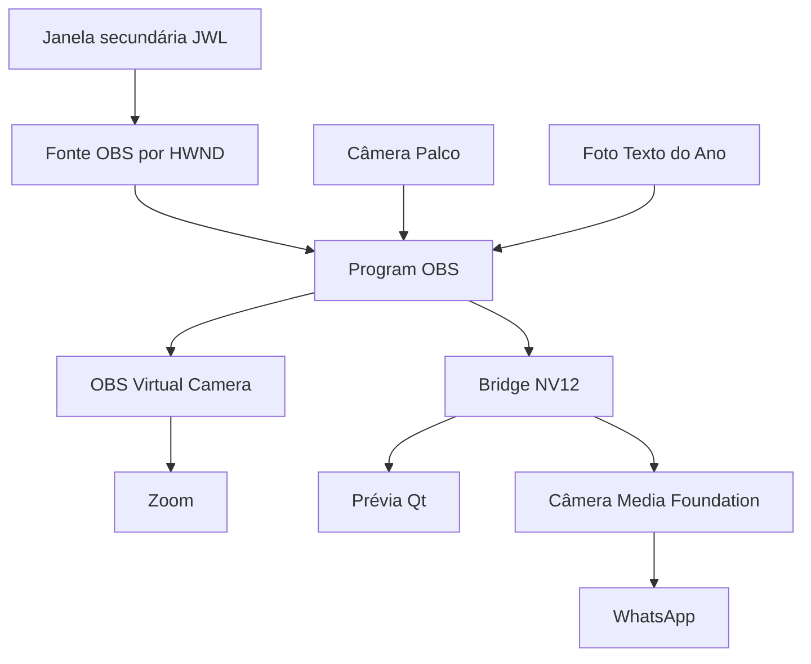

# Fluxo atual — Meeting Assistant

Revisão documental de 07/10/2026, baseada na entrega `e9bf684`.
Este documento resume os limites dos módulos; não certifica todos os ensaios.
Ver [incidentes e aprendizados](incident-history.md) e
[estado da nova captura](jwl-capture-candidate.md).

## Controle, janelas e Program

O app coordena OBS por WebSocket e serviços Windows/UIA para identificação e
operação. A janela secundária JWL é a saída física padrão; o Zoom secundário
pode substituí-la por escolha do operador. A apresentação local Zoom não
altera Program para reenviar os participantes à própria chamada.

| Módulo/caminho | Responsabilidade |
| --- | --- |
| Identificação JWL / inventário de janelas | Descobrir processo, janela e papel do monitor, sem depender de título único |
| Guardião / política do Salão | Recuperar saída quando autorizado e respeitar Zoom, mídia externa e transições |
| Sensor visual | Comparar saída JWL com referência de repouso e solicitar cenas |
| ObsController e worker serial | Executar pedidos, reconectar e confirmar estado OBS sem bloquear GUI |
| Fonte JWL HWND | Capturar somente a área cliente da janela vinculada e invalidar identidade perdida |
| Foto Texto do Ano | Capturar imagem candidata, confirmar, persistir e aplicar fonte de imagem |

Automação inicia pausada. Guardião periódico funciona somente com automação ativa.
Retorno explícito Zoom → JWL precisa funcionar também pausado. Sensor fica suspenso
durante apresentação Zoom/externa e até o retorno confirmar exposição JWL.
Sensor não é estado de reprodução obtido de uma fonte OBS inativa.

Nomes padronizados das cenas visuais: **Texto do Ano**, **Palco** e **Mídias**,
conforme mapeamento dos ajustes. Fonte visual JWL gerenciada:
**Meeting Assistant - JWL (HWND)**. A cena compartilhada de áudio tem papel
separado; não se deve inferir duplicação apenas pela presença em várias cenas.

## Entrada JWL e saídas de vídeo

A fonte HWND reutiliza `libobs-winrt` do OBS e texturas GPU. Python publica
identidade; não transporta pixels desta captura. O vínculo inclui processos,
gerações, parentesco UWP, classe e monitor. Outra janela de mesmo título não
é alternativa. A fonte não captura monitor nem áudio e não move janelas.
Windows 11 x64, OBS 31.0.3+ e Direct3D 11 são requisitos desse componente.

A bridge recebe **Program**, não Preview do modo estúdio. A câmera própria
usa **MFCreateVirtualCamera**, uma API em modo usuário; não é driver de núcleo,
injeção no WhatsApp ou dependência do NDI. OBS Virtual Camera permanece o
caminho do Zoom. Câmeras virtuais carregam vídeo; áudio tem rota independente.

Canais `Preview.v1` e `Program.v1` separam prévia e envio autorizado.
`program_video.py` mantém conexão/leitor; `program_preview.py` entrega NV12
ao renderer Qt; `camera_session.py` controla a sessão nativa. Filas limitadas
mantêm o quadro recente. Não usar PNG/JPEG periódico para recuperar fluidez.
[Arquitetura nativa completa](windows11-video-architecture.md).

## Áudio e limites físicos

| Sinal | Zoom | WhatsApp | Salão |
| --- | --- | --- | --- |
| Mesa e mídias selecionadas | Cabo A | Cabo A ou B, conforme perfil | Ligação física existente |
| Retorno Zoom | Excluído do seu próprio envio | Cabo B somente no perfil separado | Saída física |
| Retorno WhatsApp | Excluído | Excluído do seu próprio envio | Começa silenciado |

Perfil comum: OBS **Monitorar apenas (silenciar saída)** → Cabo A Input;
clientes selecionam Cabo A Output. Nenhuma faixa Program recebe as fontes locais
gerenciadas. Fontes são criadas silenciadas e ativadas após validação do operador.

Perfil separado: um segundo cabo e **Audio Monitor do Exeldro** enviam mesa/mídias
e retorno Zoom ao WhatsApp; esse retorno não entra no Cabo A. A instalação e o
teste desse perfil são distintos do aceite histórico com um cabo.

Ganho por fonte precede limitador. Salvar volumes altera filtros editados,
preservando rotas/mute/dispositivos. Limitador não desfaz clipping na entrada.
Se a mesa já mistura retorno Zoom ou mídia no sinal USB, software não separa
esses componentes com confiabilidade. [Contrato de áudio](audio-routing.md).

## Distribuição e evidência

- **Desenvolvimento:** `git pull` e `scripts/run.ps1`, Python 3.12 x64 e
  componentes prontos. Preservar mudanças locais antes de atualizar.
- **Componente JWL:** pacote próprio, hashes fixados e instalação separada;
  não recompila câmera/bridge. Assets publicados não são sobrescritos.
- **Aplicativo instalado:** atualização por instalador verificado, fora da
  reunião. O instalador já publicado não inclui este lote; integração futura
  precisa de build e ensaio próprios.
- **Aceites:** nova captura confirmada pelo operador em 07/10; contrato
  histórico JWL/Zoom preservado. CI e build não substituem ensaio de reinícios,
  troca de monitor, recepção remota ou circuito físico de áudio.

Pendências permanecem por cenário/revisão no [roteiro do projeto](roadmap-after-hall-validation.md).
