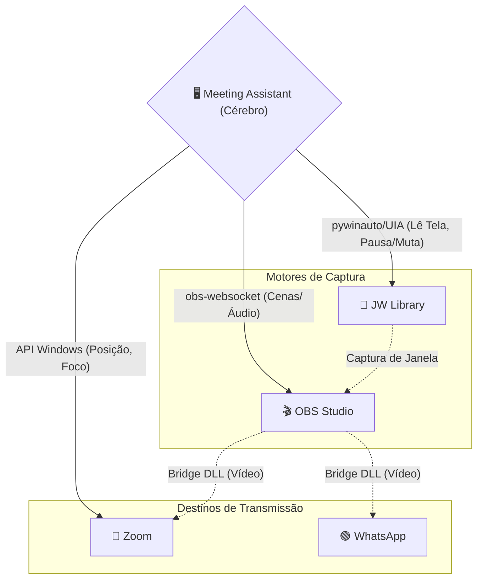
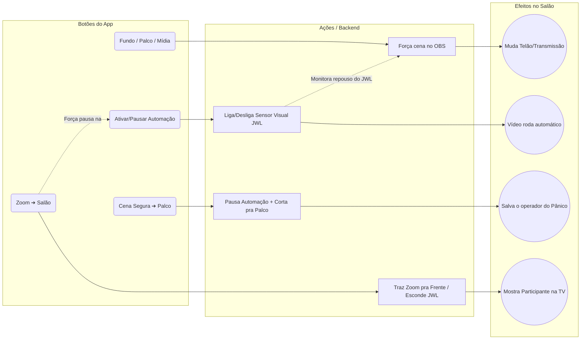
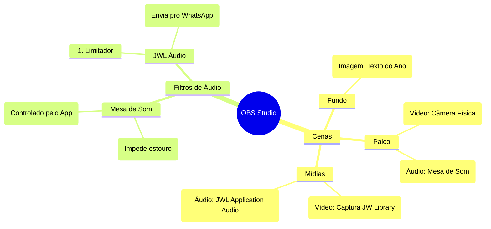
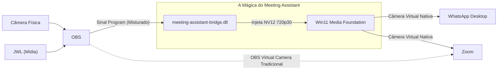
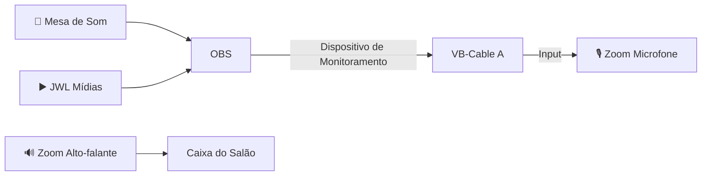
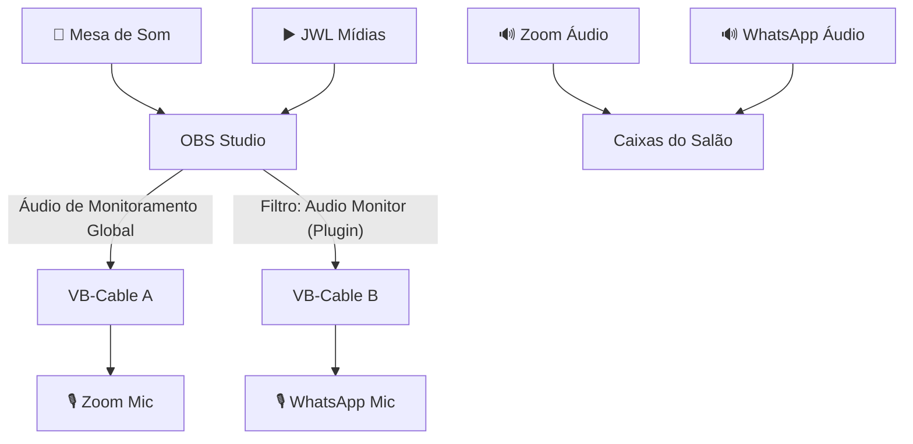

# Arquitetura Mestra — Meeting Assistant

Este documento descreve o fluxo **completo e absoluto** da operação, unindo a infraestrutura do Windows, o roteamento de áudio, o fluxo de vídeo nativo e a lógica interna do aplicativo *Meeting Assistant*.

---

## 1. Topologia Geral (Como o App controla o ecossistema)

O *Meeting Assistant* atua como o maestro, conversando com os outros softwares através de pontes invisíveis (WebSockets, UI Automation, APIs Nativas do Windows 11).

---

## 2. A Lógica do App: Botões, Estados e Automação

O aplicativo não apenas clica em botões; ele gerencia "Estados" (Background, Speaker, Media, Zoom).

### Funções Vitais do App:
*   **Guardião de Janela (JWL Fast Window Guard):** Fica em loop (180ms) garantindo que o JW Library esteja na tela secundária, na posição correta, sem barras do Windows por cima.
*   **Ducking Inteligente:** Abaixa o áudio da música de fundo automaticamente quando começa a reunião ou quando um vídeo é tocado.
*   **Controle de Microfone do Zoom:** Injeta cliques UIA diretamente no botão "Mute" do Zoom, com tempo de resposta ultrarrápido, sem precisar que o operador foque na janela do Zoom.

---

## 3. Estrutura do OBS: Cenas, Fontes e Filtros

O app exige uma estrutura rigorosa no OBS para poder rotear tudo com segurança.

---

## 4. O Fluxo de Vídeo Definitivo (Câmeras Virtuais)

O projeto usa **duas** vias de vídeo para contornar restrições do Windows 11 e do WhatsApp.

*Por que a Bridge DLL?* O WhatsApp UWP do Windows 11 frequentemente recusa a "OBS Virtual Camera" padrão. O nosso projeto cria uma câmera nativa a nível de núcleo (Media Foundation) que engana o WhatsApp perfeitamente.

---

## 5. Roteamento de Áudio: Com e Sem WhatsApp

Aqui está o coração do "Mix-Minus", separando o perfil básico do perfil avançado.

### Cenário A: Sem WhatsApp (Apenas Zoom) - 1 Cabo Virtual

### Cenário B: Com WhatsApp (Dual Cable + Audio Monitor Plugin)
Neste cenário, o WhatsApp precisa ouvir o Salão, mas não pode ouvir a si mesmo nem o Zoom.

*O Pulo do Gato:* Como a saída do Zoom vai direto para a caixa do Salão e não volta pro OBS, o WhatsApp não capta o eco do Zoom. Cada um tem seu microfone alimentado por um cabo virtual dedicado.

---

## 6. O Fluxo de Emergência (Troubleshooting do App)

O que o app faz quando algo dá errado:
1. **JWL minimizou ou perdeu foco?** O `JWLFastWindowGuard` detecta em menos de 1 segundo, tira o estado de *cloak* (oculto do Windows), desminimiza, restaura as coordenadas e traz para o monitor secundário.
2. **OBS perdeu conexão WebSocket?** O `obs_controller.py` tenta reconectar em loop sem travar a interface Qt, avisando na barra inferior.
3. **Mídia tocou, mas cena não mudou?** O operador clica no botão "Mídia" manualmente. Se precisar cancelar tudo, aperta **"Cena Segura -> Palco"**, o que força a câmera do salão e pausa a automação instantaneamente até o operador resolver o problema.
