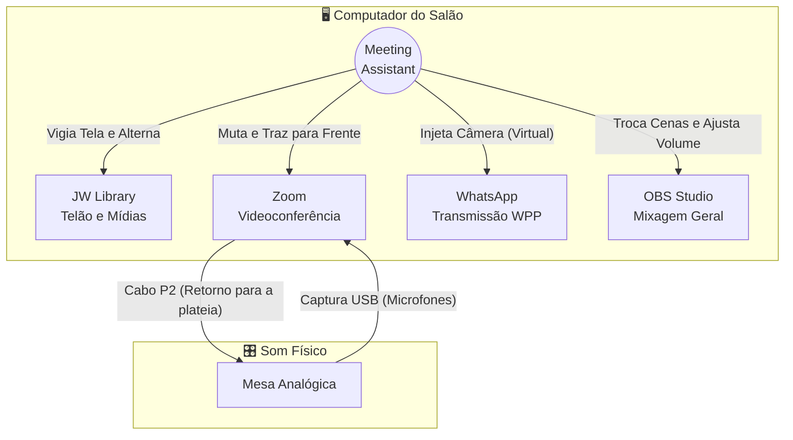
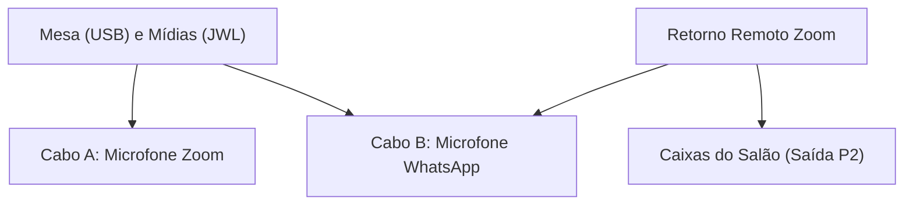
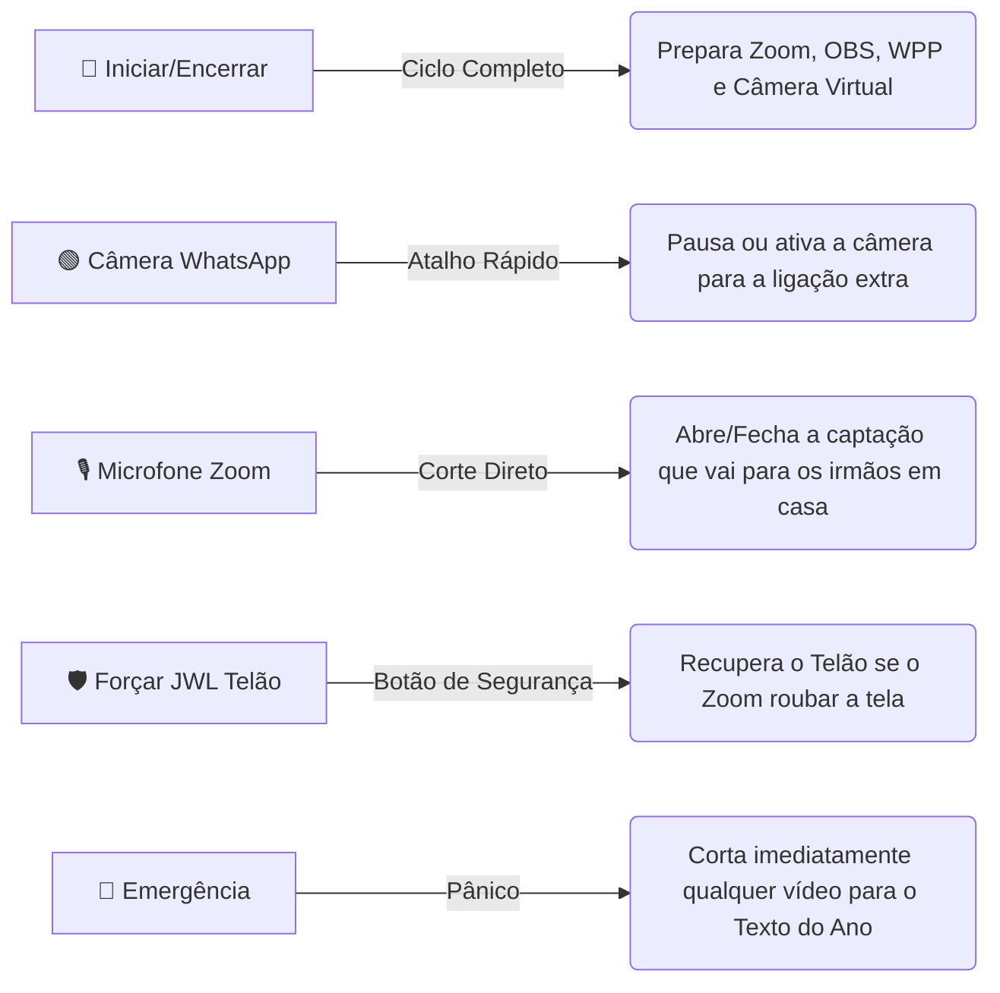

# 📖 Manual Completo do Operador: Meeting Assistant

Bem-vindo ao centro de controle do **Meeting Assistant**. Este manual foi desenhado para equipar você, Operador de Áudio e Vídeo, com todo o conhecimento prático e técnico necessário para conduzir uma reunião impecável.

---

## 🏗️ 1. O Ecossistema (Como tudo se conecta)
O Meeting Assistant não é apenas um painel com botões; ele é um **Guardião Invisível** que orquestra e sincroniza quatro programas gigantes simultaneamente: JW Library, Zoom, WhatsApp e OBS Studio.

---

## 🎛️ 2. Mapeamento de Áudio e Cabos no OBS Studio
O áudio é o coração da reunião híbrida. O Meeting Assistant reconfigura e controla o envio do som para que quem assista pelo Zoom ou WhatsApp ouça perfeitamente a mesa, as mídias, e até mesmo os comentários remotos (sem causar microfonia ou o temido "eco infinito").

### Os Dois Perfis de Envio

O sistema suporta dois perfis de roteamento, escolhidos dentro do painel `Ajustes -> Áudio -> Envio`:

#### Perfil 1: Comum (Um único cabo)
Neste perfil, as pessoas de casa (Zoom e WPP) ouvem a mesa e as mídias, mas **não** ouvem os comentários do Zoom uns dos outros pelo WPP.
- **Microfone do Zoom:** Configurado para `CABLE-A Output`.
- **Microfone do WhatsApp:** Configurado para `CABLE-A Output`.
- **Monitoramento do OBS:** O operador acessa o OBS e configura o *Dispositivo de Monitoramento de Áudio* global para `CABLE-A Input`. O aplicativo bloqueia a entrada do Zoom no OBS para evitar loop.

#### Perfil 2: WhatsApp escuta o Zoom (Dois cabos)
Necessário quando o WhatsApp precisa ouvir os comentários feitos pelos irmãos via Zoom. Exige a instalação do Cabo B e do plugin oficial *Audio Monitor* no OBS.

- **Microfone do WhatsApp:** Muda para `CABLE-B Output`.
- **Filtros Automáticos:** O Meeting Assistant criará magicamente filtros do tipo *Audio Monitor* no OBS para isolar a voz do Zoom e mandá-la exclusivamente para o WhatsApp (Cabo B), sem deixar vazar de volta para o próprio Zoom.

### As Fontes e Filtros no OBS
Ao clicar em **"Criar Fontes"** no painel de áudio do app, o Meeting Assistant cria no OBS uma cena silenciada com as seguintes fontes:
1. `Entrada de Áudio` (Sua placa USB da mesa).
2. `Captura de Aplicativo` (JW Library, VLC, Chrome).
3. `Captura de Aplicativo` (Processo de áudio do Zoom - apenas no Perfil 2).

**Filtros Aplicados (Proteção e Volume):**
Cada fonte criada ganha, obrigatoriamente, dois filtros pela nossa automação:
- **Ganho (0 a 18 dB):** Permite subir o volume de mídias muito baixas sem mexer no Windows. (Ajustável na aba *Volumes* do nosso app).
- **Limitador (-3 dB):** O Guardião invisível que impede que um som repentino ou um microfone batido "estoure" (clipping) o áudio dos irmãos em casa.

> [!CAUTION]
> **Atenção Física Máxima:** O cabo USB que vem da sua mesa de som deve trazer **apenas** a voz dos microfones do salão. Se o técnico de som da mesa enviar o retorno do computador para esse cabo USB, o OBS dobrará a mídia, causando microfonia e distorção severa.

---

## 🕹️ 3. O Painel de Controle Frontal

A interface foi redesenhada para que você não precise tirar os olhos da reunião. Tudo está a um clique de distância.

### Detalhamento dos Comandos:
- 🔘 **Botão de Energia (Iniciar/Encerrar Reunião):** É o mestre da operação. No início da reunião, ao dar "Iniciar", ele pré-aquece as conexões de áudio, limpa janelas residuais e ativa a ponte com o OBS. No final da reunião, ele fecha as abas do Zoom e encerra os programas graciosamente.
- 🟢 **Controle do WhatsApp:** Uma chave simples para ativar ou desativar o envio de vídeo para a ligação do WhatsApp (extremamente útil quando só há Zoom ativo).
- 🛡️ **Forçar JWL Telão:** O Zoom atualizou e roubou a tela secundária? A janela minimizou? Clique neste escudo. O sistema buscará o player do JW Library a força e o colocará na tela estendida.
- 🚨 **Emergência (Tela Preta/Texto):** Use se o PC der uma travada feia durante a reprodução de um vídeo ou surgir algo inadequado. Ele corta a imagem e manda o sinal do OBS imediatamente para a cena de Repouso.

---

## 🤖 4. A Automação (O Guardião Invisível)
A beleza do Meeting Assistant é que você não precisa coordenar o OBS e o JW Library ao mesmo tempo. O **Guardião** vigia os pixels da sua tela dezenas de vezes por segundo.

1. **Estado de Repouso:** Quando a tela principal do JWL exibe apenas a imagem estática do "Texto do Ano", o Guardião informa ao OBS: *"Coloque a Câmera do Palco no ar"*.
2. **Estado de Mídia:** No milissegundo em que você aperta "Play" num cântico ou vídeo, o Guardião avisa ao OBS: *"Corte a câmera do Palco, coloque a cena de Mídias e libere o áudio interno"*.
3. **Transição Automática:** Assim que o vídeo do JWL atinge 100%, o Guardião devolve a imagem suavemente para o Palco.

> [!NOTE]
> Durante essa transição de vídeo, o app entra numa "Pausa" microscópica para não atropelar comandos. Apenas relaxe e deixe o Guardião agir.

---

## ⚙️ 5. Menu de Ajustes e Ferramentas

Ao clicar na catraca de Ajustes, você acessa o coração técnico do aplicativo:

- **Mídias da Reunião 📥:** (Estrutura pronta para a V2.0). Aqui você define o idioma da congregação (Ex: `T` para Português). Em breve, um toque nesse botão vasculhará os servidores do jw.org e preparará um pacote automático com todas as mídias da semana para você importar.
- **Calibrar Texto do Ano:** Como o Guardião sabe que um vídeo começou? Ele compara com a "foto" da sua tela parada. Se você trocar a imagem de fundo (ex: novo ano de serviço), clique aqui para calibrar o sensor.
- **Rede (WebSocket):** Painel para garantir que a ponte de IPs entre o Meeting Assistant e o OBS Studio está fluindo sem barreiras de Firewall.

---

## 🚑 6. Resolução Rápida de Problemas (Troubleshooting)

| Sintoma na Reunião | Qual a provável causa? | O que o Operador deve fazer? |
| :--- | :--- | :--- |
| **OBS não responde ao App** | OBS foi aberto *depois* ou está com senha velha no painel. | Cheque as luzes de rede do app. Verifique a aba *WebSocket Server Settings* no OBS. |
| **Os irmãos em casa escutam a própria voz dobrada** | O Zoom está capturando sua própria saída. | Verifique imediatamente se o PC está mandando o som para a **Saída P2** em vez do Cabo Virtual. |
| **Vídeo do JWL tá tocando, mas a TV mostra a galeria do Zoom** | O Zoom roubou o foco da segunda tela (Telão). | Sem pânico. Clique no botão **🛡️ Forçar JWL Telão** no painel principal. |
| **Câmera do WPP sumiu** | Configuração do WhatsApp foi desmarcada. | Vá em Ajustes, reative a caixinha do WhatsApp e alterne a câmera no painel frontal. |

---
*Construído com excelência para aliviar a carga operacional e manter o foco exclusivamente no ensino espiritual.*
